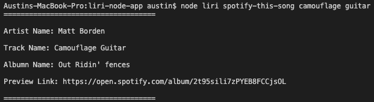
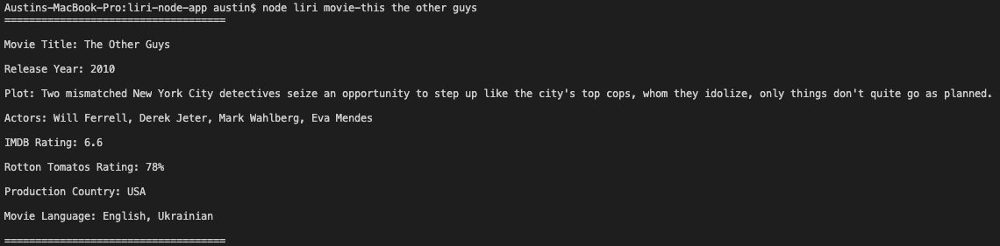
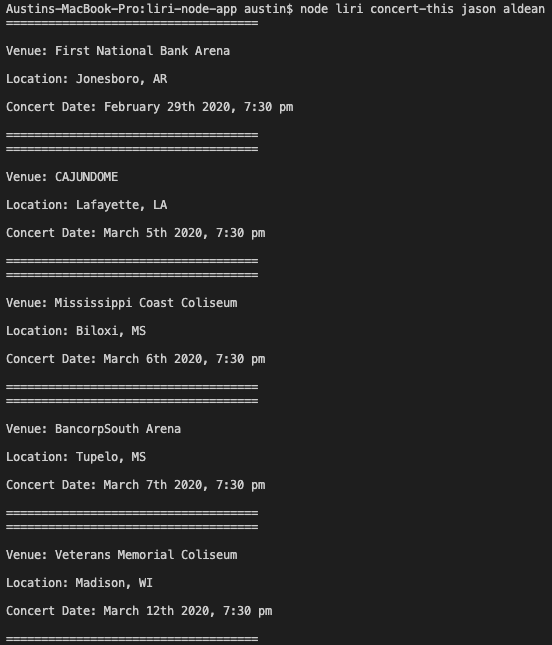
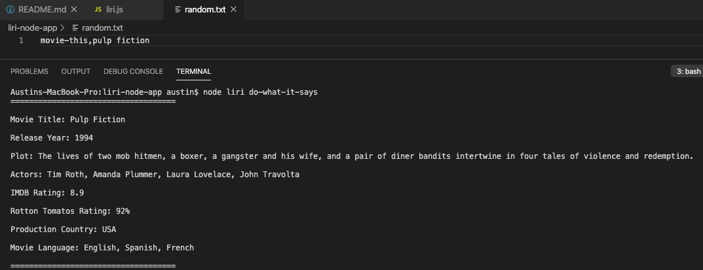
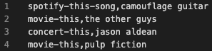

# **Liri Node App**
This is a text based driven app that allows a user to get information about a particular song, a movie, or see the next 5 concerts for a music artist or a band.

---

### **NPM Dependencies**

* DotEnv
* Request
* Axios
* Moment
* FS
* Node-Spotify-API

### **API's Used**

* Spotify
* OMDB
* Bands In Town

---

### **Initial Setup**
Naviagte to the folder in your terminal, and install all the necessary dependencies with:

```
npm i
```

### **How To Utilize Liri**

---

**Songs**

If you would like to look up data about a song, type the following in your terminal:

```
node liri spotify-this-song <song name here>
```

It will output the following:

* Artist(s)
* The song's name
* A preview link of the song from Spotify
* The album that the song is from

_If a song name is not provided, results for the song "151 Rum" by JID will be returned._

_**Demo:**_



---

**Movies**

If you would like to look up data about a movie, type the following in your terminal:

```
node liri movie-this <movie name here>
```

It will output the following:

* Movie Title
* Release Year
* Plot
* Actors
* IMDB Rating
* Rotten Tomatoes Rating
* Production Country
* Language(s)

_If a movie name is not provided, results for the movie "Ted" will be returned._

_**Demo:**_



---

**Concerts**

If you would like to look up upcoming concerts for a music artist, type the following in your terminal:

```
node liri concert-this <artist/band name here>
```

It will output the following for the next 5 concerts:

* Venue Name
* Venue Location
* Date of the Event

_If an artist or band name is not provided, results for the band "Run the Jewels" will be returned._

_**Demo:**_



---

**Do What It Says**

There is a file called `random.txt` that contains a command to be run. Use the following code to access it:

```
node liri do-what-it-says
```

This will work the same as the other functions based of what ever is entered in the text file.

_**Demo:**_



---

### **The Log File**

The `log.txt` file simply captures all of the commands that have been entered.

_**Demo:**_

